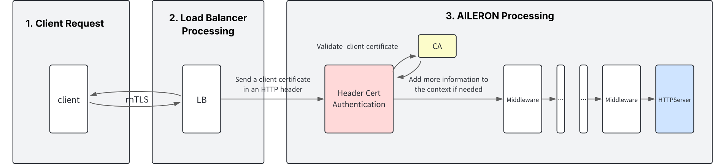

# 概要
本ミドルウェアは、HTTP ヘッダーに提供されたクライアント証明書を使用して API 呼び出しを認証します。

# 動機
このハンドラーは、TLS トラフィックが外部の CDN またはロードバランサによって AILERON ゲートウェイに到達する前に終了される場合に便利です。 クライアント証明書は、HTTP ヘッダーに引き渡され、その後の検証に使用されます。

# 目標
- HTTP ヘッダーで受信したクライアント証明書を検証します。
- 無効または期限切れのクライアント証明書を持つリクエストを拒否します。
- 証明書が信頼された CA によって署名されていることを確認します。
- クライアント証明書を提供されたフィンガープリントと照合します。

# 非目標
- 各種のロギングやモニタリング機能を実装すること。
- 基本的なチェックを超えた証明書検証オプションの広範なカスタマイズを提供すること。
- 証明書失効リスト（CRL）やより複雑な CA の階層をサポートすること。


# 技術設計
クライアント証明書検証フロー
本ミドルウェアは、クライアント証明書を検証し、リクエストを上流サーバーに転送します。以下の画像に示されています。



1. クライアントリクエスト

   クライアントは、安全な通信のために TLS を使用してリクエストを開始します。
2. CDN/ロードバランサの処理

   リクエストは CDN またはロードバランサに到達し、ここでクライアントとの TLS 接続はすでに終了しています。CDN/ロードバランサはクライアント証明書を抽出し、リクエストヘッダーに追加します。
3. ミドルウェアの実行
   
   ミドルウェアは、指定された HTTP ヘッダー（例: X-SSL-Client-Cert, X-SSL-Client-Fingerprint）からクライアント証明書を抽出します。
   ミドルウェアは以下の内容を検証します：
   - クライアント証明書が期限切れでないこと。
   - 証明書が信頼された CA によって発行されていること（設定されたルート CA ファイルによって判断されます）。
   - 証明書フィンガープリントがリクエストヘッダー内の提供されたフィンガープリントと一致すること（SHA256 でハッシュ化されたものでなければなりません）。

4. リクエストの転送
   
   検証に成功した場合、リクエストは上流サーバーに転送され、さらなる処理が行われます。
   検証に失敗した場合は、適切なエラーレスポンスが生成されます。

# エラーハンドリング
ミドルウェアは、検証の結果に基づいて以下の HTTP ステータスコードを返します：

- 400: Bad Request: リクエストが有効なクライアント証明書またはフィンガープリントを含まない場合に返されます。
- 401: Unauthorized: クライアント証明書が無効であるか、フィンガープリントが一致しない場合に返されます。
- 500: Internal Server Error: ミドルウェアがルート証明書を読み取れないか、上流サーバーへのリクエストを作成できない場合に返されます。これらはクライアントによって引き起こされないエラーです。

# CA 設定
ミドルウェアは、クライアント証明書を検証するためにローカル証明書ファイル（rootCA.crt）を使用します。このファイルは正しく設定され、ミドルウェアがアクセスできる必要があります。

# 作成手順
1. mkcertを用いてルート証明書(`rootCA.crt`)とクライアント証明書/秘密鍵（`client.crt`/`client.key`）のペアを作成
2. クライアント証明書からフィンガープリントを作成(`pki/fingerprint.txt`)
3. 以下の機能を満たすミドルウェアを作成(`main.go`)
   - クライアント証明書を検証するミドルウェア
     - リクエストのヘッダから証明書とフィンガープリントを取りだし、以下3点を検証する
         1. 有効期限が切れていないか
         2. 証明書が信頼できる認証局としてAILERONに登録されてる認証局から発行されたものか
         3. 証明書をSHA256でハッシュ化した値とクライアントから送られてくるフィンガープリントが一致するか
     - 検証に成功した場合は処理を続行
     - 検証に失敗した場合は400, 401, 500エラーを返して終了

# 実行手順
1. 以下のコマンドを実行してミドルウェア、アップストリーミングサーバを起動
    ```bash
    go run .
    ```
2. 以下のコマンドを実行して、ミドルウェアに対してリクエストを送信
    ```bash
    curl -v --cert pki/client.crt --key pki/client.key \
     -H "X-SSL-Client-Cert: $(base64 -w 0 pki/client.crt)" \
     -H "X-SSL-Client-Fingerprint: $(cat pki/fingerprint.txt)" \
     http://localhost:8080/
     ```